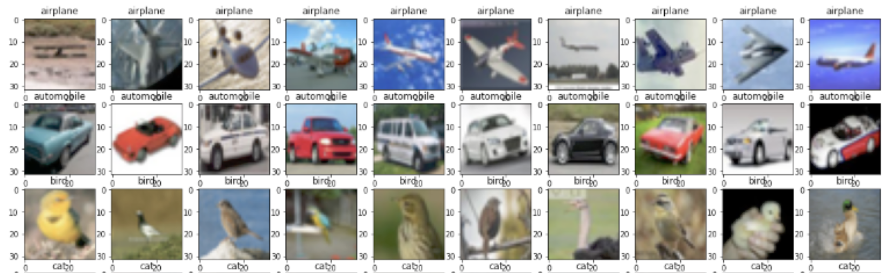

</img>

# CIF-NN789k
A 789K parameter Neural Network, built in pure NumPy, with Adam + BatchNorm, to classify the CIFAR-10 dataset.

### Architecture:

A feed forward neural network with 2 Layers, 1 hidden, 1 output

Using BatchNorm and the Adam Optimizer

Input Size: 3072 
Hidden Layer Size: 512 
Output Layer Size: 10

### Hyperparameters

`Alpha`: .01 
`Beta_1` (first moment term): .9 
`Beta_2` (second moemnt term): .99 

### Training Results

The model was trained on 50000 images from the CIFAR-10 dataset.

Mini-Batch Size: 2048 samples 
Total Mini Batches: 24 
Epochs: 1000 (24000 training steps)

Final Training Accuracy: 99.5117 
Final Training Loss: 0.02777691373685564

### Testing Results

The model was tested on 10000 unseen images from the CIFAR-10 dataset 
