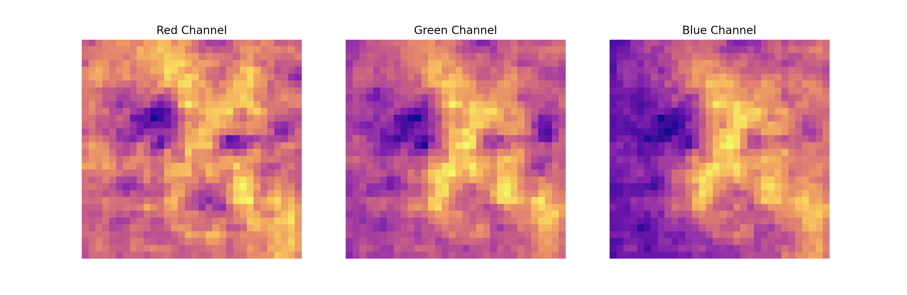

</img>

# CIF-NN-789k
A 789K parameter Neural Network, built in pure NumPy, with Adam + BatchNorm, to classify the CIFAR-10 dataset.

Here, I test the limits of Feed Forward Neural Networks in classifying color images.

### Architecture:

A feed forward neural network with 2 Layers, 1 hidden, 1 output

Using BatchNorm and the Adam Optimizer

Input Size: 3072 
Hidden Layer Size: 256 
Output Layer Size: 10

</img> 
<em style = 'font-size: 14px'>Internals of the model, @ the 120th neuron in the hidden layer, visualized in 3 color dimensions.</em>

### Hyperparameters

`Alpha`: .01, changed to .0001 after ~50% accuracy 
`Beta_1` (first moment term): .9 
`Beta_2` (second moemnt term): .99 

### Training Results

The model was trained on 50000 images from the CIFAR-10 dataset.

Mini-Batch Size: 2048 samples 
Total Mini Batches: 24 
Epochs: 1000 (24000 training steps)

Loss: 1.0992273617467658 
Accuracy: 61.669921875

### Testing

Accuracy: 49.4140625 
Loss: 1.5121818052284461

After days of empirical testing and hours of compute time (I'm on a macbook, bear with me), I now conclude that I'm wasting my time trying to fit to a FF-Neural Net to 90%+ accuracy on CIFAR-10.

It's best I just leave this up to CNNs.
